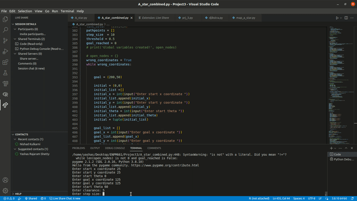

# Path Planning for 2D Mobile robot using the A* algorithm

The A star algorith is an extension of the Djikstra's algorithm. In this project, we implement the A* algorithm for a 2D mobile robot with a constrained action set.

## Instructions to run

To run a star algorithm, simple sun `a_star_nishad_yashas.py`. Enter valid inputs or the code will ask you to enter valid inputs again.

## Sample

